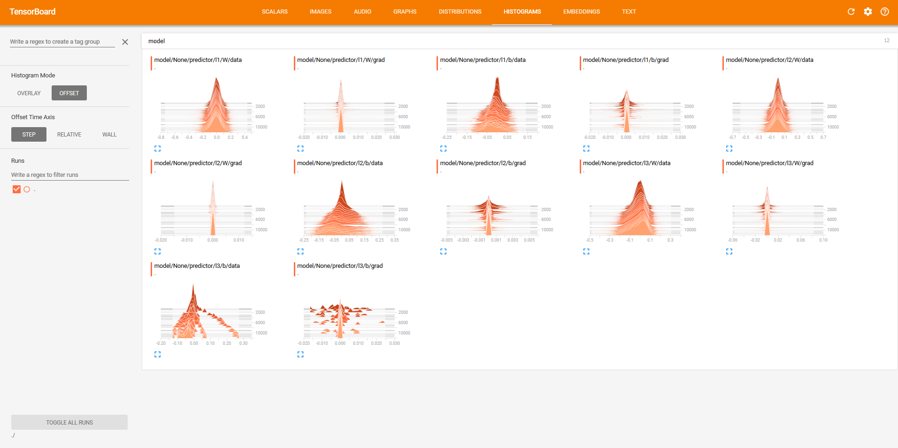

# chainer_extensions

## Installation
- Install [chainer](https://github.com/chainer/chainer) 
- Install [tensorboardX](https://github.com/lanpa/tensorboard-pytorch) 
```bash
pip install chainer
pip install tensorboardX
```

## ParameterStatisticsX
```python
from extensions import ParameterStatisticsX
trainer.extend(ParameterStatisticsX(model, prefix='model', log_dir=<log_dir>))
```



```bash
cd <log_dir>
tensorboard --logdir=./
```